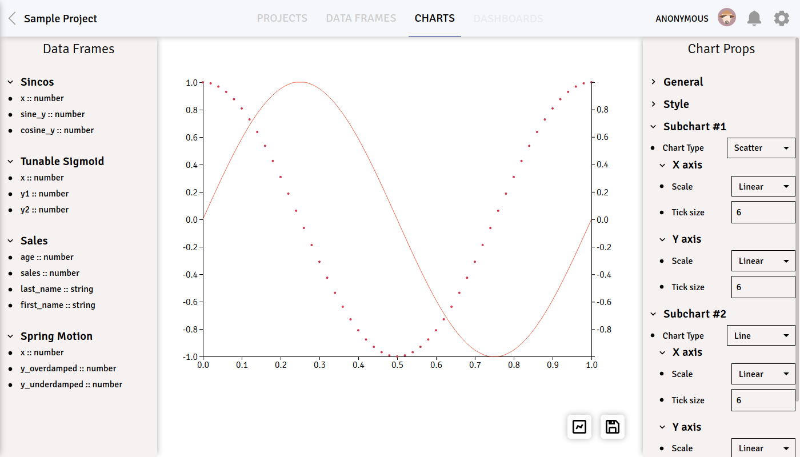

## Dashchart

Dashchart (you can interpret the name as "dashboards + charts" or - if you're daring -
"dashing charts") is a React app written to explore bits of
[fp-ts](https://github.com/gcanti/fp-ts).

Basic idea is simple:

1. Download CSV file
2. Drag and drop CSV columns into chart canvas
3. Adjust chart properties to your heart's content
4. Voila, chart is ready!

App relies on `fp-ts` extensively, especially its [Either](https://gcanti.github.io/fp-ts/modules/Either.ts.html)
monad for elegant and type-safe error handling. If you wish to take a peek at how it's used in chart creator, I recommend starting with
[`AggregateChartMapper.ts`](https://github.com/frysztak/dashchart/blob/master/src/client/components/charts/AggregateChartMapper.ts) and
files inside [`charts/common`](https://github.com/frysztak/dashchart/tree/master/src/client/components/charts/common).
You can also find `TaskEither` in [`CSV.ts`](https://github.com/frysztak/dashchart/blob/master/src/shared/loaders/CSV.ts) to handle asynchronous parsing.

Rest of frontend stack is as follows: Next.js, React, Redux-Toolkit and Styled Components. Prisma and Next.js are used for
a simplistic backend. Everything is packaged into a Docker container and deployed to my VPS with a single `git push`, thanks to
GitLab CI.

Live demo is available [here](https://dashchart.frysztak.net).
